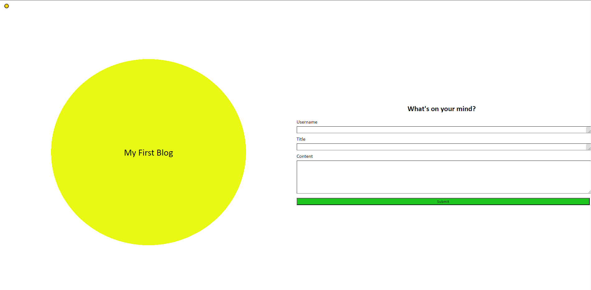

# My-Blog

## Description
This project was made to build familiarity manipulating local storage with Javascript. It stores user entries into a JSON array and links to a page which loads and displays all posts in local storage.

[A link to the website](https://akaufmanfrey.github.io/my-blog/)

## Installation

N/A

## Usage

A tool for a user to create a personal blog. They can write and view their posts. Their posts are stored in the user's local storage.

## Credits

N/A

## License

Please refer to the LICENSE in the repo.